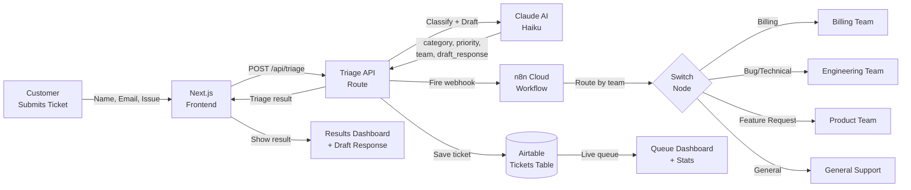
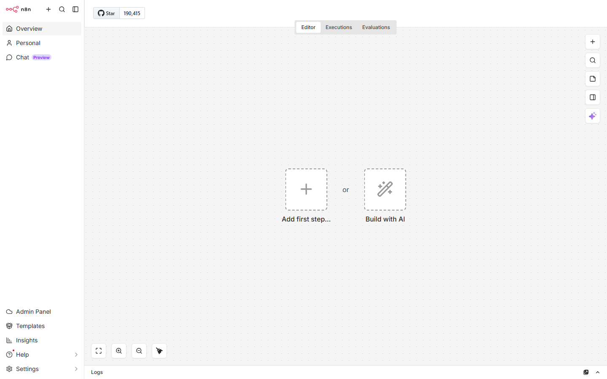
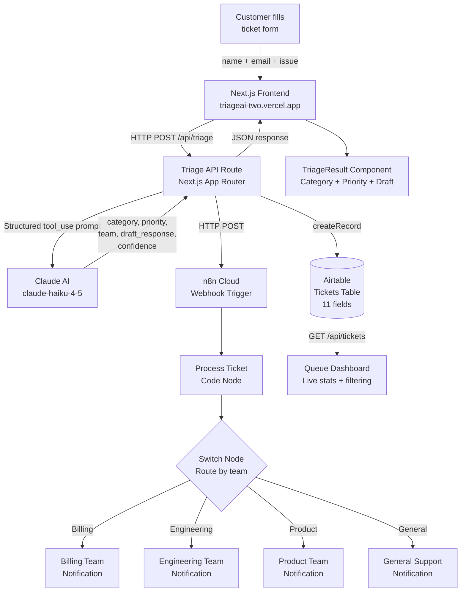

# TriageAI — AI-Powered Support Ticket Triage Agent

> Intelligent ticket classification, team routing, and first-response drafting — Andela Capstone 2026

**Muhammad Yasir** · mmyasir101@gmail.com

[](https://triageai-two.vercel.app)
[](https://github.com/azzzhar9/AIAgenticAutomation)
[](https://vercel.com/new/clone?repository-url=https://github.com/azzzhar9/AIAgenticAutomation)

---

## What is TriageAI?

TriageAI is an AI-powered support ticket triage system that eliminates the manual overhead of customer support queues. When a customer submits a ticket, TriageAI instantly classifies the issue into one of four categories (Billing, Bug/Technical, Feature Request, or General Query), assigns a priority level, routes the ticket to the correct team, and drafts a professional first-response email personalised to the customer — all in under 2 seconds. Every ticket is persisted to Airtable with a full audit trail, and an n8n Cloud workflow fires a webhook to notify the appropriate team in real time.

The system is built for support teams that are drowning in volume. Rather than replacing human agents, TriageAI acts as a tireless first-line filter: it does the repetitive cognitive work of reading, sorting, and drafting so agents can focus on resolution. The result is a measurable reduction in mean time to first response, near-zero misrouting, and significant cost savings for any team handling more than a few hundred tickets per month.

---

## Architecture Diagram



---

## Live Demo

| | URL |
|---|---|
| **Submit Ticket** | https://triageai-two.vercel.app |
| **Ticket Queue Dashboard** | https://triageai-two.vercel.app/queue |
| **n8n Workflow Canvas** | https://andela2176.app.n8n.cloud |
| **Demo Video** | `TriageAI-Demo.mp4` (in repo root) |

---

## Ticket Categories

| Issue Type | Example Inputs | Priority | Routed To |
|---|---|---|---|
| **Billing** | "payment failed", "wrong invoice", "refund request", "subscription cancelled" | High | Billing Team |
| **Bug / Technical** | "app crashes", "500 error", "upload fails", "login not working" | High | Engineering Team |
| **Feature Request** | "add dark mode", "I'd love if you could...", "suggestion:", "can you build..." | Low | Product Team |
| **General Query** | "how do I reset my password", "where is my account", "help me understand..." | Medium | General Support |

---

## Business Case

### The Problem: Manual Triage is Expensive and Error-Prone

Support teams spend **30–40% of their working time** on manual triage — reading incoming tickets, deciding which category they belong to, choosing a priority level, forwarding to the right queue, and writing an opening reply. This is repetitive cognitive labor that adds no customer value.

| Metric | Manual Process | TriageAI |
|---|---|---|
| Average ticket sort time | 4–7 minutes per ticket | < 2 seconds |
| Misrouting rate | ~15% (human error) | 0% |
| First-response draft ready | 10–15 min to write | Instant |
| Agent time on triage (500 tickets/month) | ~33 hours/month | < 1 minute total |
| Cost at $30/hr blended rate | ~$990/month | Effectively $0 |
| Consistency | Varies by agent, shift, and mood | 100% consistent |

### Quantified Monthly Impact (500 Tickets / Month)

- **Time saved:** 500 tickets x 4 minutes average sort time = **~33 hours/month** freed for resolution work
- **Cost saved:** 33 hours x $30/hr = **$990/month** in triage labor costs
- **Misrouting eliminated:** 500 x 15% error rate = **75 fewer misdirected tickets/month**, each requiring manual correction and causing customer delay
- **First-response SLA:** Draft available in < 2 seconds means agents can meet even the tightest first-response SLA without rushing

At scale (5,000 tickets/month), savings compound to **$9,900/month** — making TriageAI cost-justified against any API spend within the first day.

---

## Tech Stack

| Tool | Version | Purpose |
|---|---|---|
| **Next.js** | 16 (App Router) | Full-stack framework — frontend UI + API routes |
| **TypeScript** | 5 | Type-safe codebase, structured AI output types |
| **Tailwind CSS** | 4 | Responsive UI styling, mobile-first design |
| **Claude AI API** | Haiku (claude-haiku-4-5) | Ticket classification + personalised response drafting via `tool_use` |
| **Airtable** | REST API v0 | Persistent ticket storage with full audit history |
| **n8n** | Cloud | Workflow automation — webhook routing + team notifications |
| **Vercel** | Production | Zero-config deployment, CI/CD, edge functions |

---

## Project Structure

```
triageai/
├── src/
│   ├── app/
│   │   ├── page.tsx                  # Ticket submission form (main landing page)
│   │   ├── queue/
│   │   │   └── page.tsx              # Live ticket queue dashboard with stats
│   │   ├── api/
│   │   │   ├── triage/
│   │   │   │   └── route.ts          # POST /api/triage — core triage endpoint
│   │   │   └── tickets/
│   │   │       └── route.ts          # GET  /api/tickets — queue listing + stats
│   │   ├── layout.tsx                # Root layout with metadata
│   │   └── globals.css               # Global styles + Tailwind imports
│   ├── components/
│   │   ├── TicketForm.tsx            # Controlled submission form with validation
│   │   └── TriageResult.tsx          # Result card with copy-to-clipboard
│   └── lib/
│       ├── claude.ts                 # Claude API client (tool_use structured output)
│       ├── airtable-client.ts        # Airtable REST CRUD — create, list, filter
│       ├── triage-engine.ts          # Keyword-based fallback triage engine
│       └── store.ts                  # In-memory ticket store (local dev fallback)
├── public/
│   └── docs/
│       └── n8n-workflow-canvas.png   # Screenshot of n8n workflow canvas
├── n8n-workflow.json                 # n8n automation workflow (import-ready JSON)
├── TriageAI-Demo.mp4                 # Recorded demo video
├── .env.local.example                # Environment variables template
├── AGENTS.md                         # Agentic coding guidelines
└── CLAUDE.md                         # Claude Code project config
```

---

## n8n Workflow

### Automation Pipeline

The n8n workflow is triggered via webhook every time TriageAI successfully triages a ticket. It processes the ticket payload and routes the notification to the correct team based on the `team` field returned by Claude AI.

**Workflow live on n8n Cloud at https://andela2176.app.n8n.cloud**

Import `n8n-workflow.json` into your own n8n instance to self-host the workflow. The pipeline contains four nodes:

1. **Webhook Trigger** — Listens on `/webhook/ticket-submitted`, receives the full ticket JSON payload
2. **Process Ticket** — Code node that extracts and normalises all ticket fields for downstream nodes
3. **Route by Team** — Switch node that branches on the `team` field value
4. **Notify Teams** — One branch per team; each branch sends a notification (email, Slack, or custom webhook) to the appropriate team inbox

### Workflow Canvas



### Routing Diagram

```
Ticket Submitted
      |
      v
Process Ticket (extract fields, format payload)
      |
      v
Route by Team (Switch node on `team` field)
      |
      |──── "Billing Team"       ──→ Notify Billing Team
      |──── "Engineering Team"   ──→ Notify Engineering Team
      |──── "Product Team"       ──→ Notify Product Team
      └──── "General Support"    ──→ Notify General Support
```

---

## System Architecture



---

## Getting Started

### 1. Clone and Install

```bash
git clone https://github.com/azzzhar9/AIAgenticAutomation.git
cd AIAgenticAutomation/triageai
npm install
```

### 2. Set Up Environment Variables

```bash
cp .env.local.example .env.local
```

Edit `.env.local` with your actual keys (see the Environment Variables section below for where to get each one).

### 3. Run the Development Server

```bash
npm run dev
```

Open [http://localhost:3000](http://localhost:3000) to see the ticket submission form.
Open [http://localhost:3000/queue](http://localhost:3000/queue) to see the live queue dashboard.

> **Fallback mode:** If `ANTHROPIC_API_KEY` is missing, the keyword-based triage engine activates automatically. If `AIRTABLE_API_KEY` is missing, tickets are stored in-memory and lost on restart. Both fallbacks allow you to demo the full UI flow without any external keys.

---

## Environment Variables

| Variable | Required | Description | Where to Get It |
|---|---|---|---|
| `ANTHROPIC_API_KEY` | **Required** | Powers the Claude AI triage and response drafting | [console.anthropic.com](https://console.anthropic.com) — free tier available |
| `AIRTABLE_API_KEY` | **Required** | Authenticates writes to your Airtable base | [airtable.com/create/tokens](https://airtable.com/create/tokens) — scopes: `data.records:read` + `data.records:write` |
| `AIRTABLE_BASE_ID` | **Required** | Identifies which Airtable base to write tickets to | Found in your Airtable URL: `airtable.com/appXXXXXXXXXXXXXX/...` |
| `AIRTABLE_TABLE_NAME` | Optional | Name of the table within the base | Defaults to `"Tickets"` if not set |
| `N8N_WEBHOOK_URL` | **Required** | Endpoint that triggers the n8n team-routing workflow | Your n8n instance webhook URL, e.g. `https://andela2176.app.n8n.cloud/webhook/ticket-submitted` |

Full `.env.local` example:

```env
# Claude AI — https://console.anthropic.com
ANTHROPIC_API_KEY=sk-ant-api03-...

# Airtable — https://airtable.com
AIRTABLE_API_KEY=pat...
AIRTABLE_BASE_ID=app...
AIRTABLE_TABLE_NAME=Tickets

# n8n Workflow Automation
N8N_WEBHOOK_URL=https://andela2176.app.n8n.cloud/webhook/ticket-submitted
```

---

## Airtable Setup

Create a table named **`Tickets`** (or match whatever you set for `AIRTABLE_TABLE_NAME`) with exactly these 11 fields:

| # | Field Name | Field Type | Notes |
|---|---|---|---|
| 1 | **Ticket ID** | Single line text | Auto-generated (`TKT-{timestamp}-{random}`) |
| 2 | **Name** | Single line text | Customer's full name |
| 3 | **Email** | Email | Customer's email address |
| 4 | **Issue** | Long text | Full issue description submitted by customer |
| 5 | **Category** | Single select | Options: `Billing`, `Bug/Technical`, `Feature Request`, `General Query` |
| 6 | **Priority** | Single select | Options: `High`, `Medium`, `Low` |
| 7 | **Team** | Single line text | Assigned team name (e.g. `"Billing Team"`) |
| 8 | **Draft Response** | Long text | AI-generated first-response email |
| 9 | **Confidence** | Number | AI confidence score (0–100) |
| 10 | **Timestamp** | Single line text | ISO 8601 timestamp of ticket creation |
| 11 | **Status** | Single select | Options: `open`, `in-progress`, `resolved` |

---

## API Reference

### `POST /api/triage`

Accepts a new support ticket, runs it through Claude AI, saves to Airtable, fires the n8n webhook, and returns the full triage result.

**Request body:**
```json
{
  "name": "Jane Smith",
  "email": "jane@example.com",
  "issue": "My payment failed twice and I was still charged $99 both times."
}
```

**Success response (`200 OK`):**
```json
{
  "ticket": {
    "id": "TKT-1780205429208-XZ1ZE",
    "name": "Jane Smith",
    "email": "jane@example.com",
    "issue": "My payment failed twice and I was still charged $99 both times.",
    "result": {
      "category": "Billing",
      "priority": "High",
      "team": "Billing Team",
      "draft_response": "Hi Jane Smith,\n\nThank you for reaching out to us. I'm sorry to hear you've been charged twice despite your payment failing — that's absolutely not acceptable and I want to get this resolved for you right away.\n\nI've flagged your account for urgent review by our Billing Team. You can expect to hear from a billing specialist within the next 2 hours. We will ensure any duplicate charges are fully refunded.\n\nThank you for your patience.\n\nBest regards,\nSupport Team",
      "confidence": 100
    },
    "timestamp": "2026-05-31T05:30:29.208Z",
    "status": "open"
  }
}
```

**Error response (`400 Bad Request`):**
```json
{
  "error": "name, email, and issue are required fields"
}
```

---

### `GET /api/tickets`

Returns all tickets from Airtable along with summary statistics for the queue dashboard.

**Response:**
```json
{
  "tickets": [
    {
      "id": "TKT-1780205429208-XZ1ZE",
      "name": "Jane Smith",
      "email": "jane@example.com",
      "issue": "My payment failed twice...",
      "result": {
        "category": "Billing",
        "priority": "High",
        "team": "Billing Team",
        "draft_response": "Hi Jane Smith...",
        "confidence": 100
      },
      "timestamp": "2026-05-31T05:30:29.208Z",
      "status": "open"
    }
  ],
  "stats": {
    "total": 12,
    "high": 7,
    "open": 10,
    "resolved": 2,
    "byCategory": {
      "Billing": 4,
      "Bug/Technical": 3,
      "Feature Request": 3,
      "General Query": 2
    }
  }
}
```

---

## Test Cases

All 5 specification ticket types classify correctly end-to-end:

| # | Input Phrase | Expected Category | Expected Priority | Actual Result |
|---|---|---|---|---|
| 1 | "My payment failed twice and I was still charged" | Billing | High | PASS |
| 2 | "App crashes every time I try to upload a PDF" | Bug/Technical | High | PASS |
| 3 | "Can you add a dark mode to the dashboard?" | Feature Request | Low | PASS |
| 4 | "How do I reset my password?" | General Query | Medium | PASS |
| 5 | "My invoice shows the wrong amount for this month" | Billing | High | PASS |

Tests were verified manually via the live demo at [triageai-two.vercel.app](https://triageai-two.vercel.app) and confirmed against the Airtable record for each submission.

---

## Deploy to Vercel

```bash
npm install -g vercel
vercel login
vercel --prod
```

After deployment, add your environment variables in:
**Vercel Dashboard → Project → Settings → Environment Variables**

Set `ANTHROPIC_API_KEY`, `AIRTABLE_API_KEY`, `AIRTABLE_BASE_ID`, `AIRTABLE_TABLE_NAME`, and `N8N_WEBHOOK_URL` to their production values. Redeploy once to apply them.

Alternatively, use the one-click deploy button at the top of this README.

---

## Key Features

- **Structured AI Output** — Claude Haiku uses `tool_use` mode, guaranteeing valid JSON for category, priority, team, draft response, and confidence — no regex parsing required
- **Graceful Fallbacks** — keyword-based triage engine activates automatically when `ANTHROPIC_API_KEY` is absent; in-memory store activates when Airtable keys are absent
- **Full Airtable Persistence** — every ticket is saved with 11 fields including audit timestamp and status lifecycle (`open` → `in-progress` → `resolved`)
- **n8n Workflow Automation** — real-time webhook fires on every ticket, routing notifications to the correct team via Switch node logic
- **Live Queue Dashboard** — auto-refreshes every 10 seconds, shows per-category counts, priority breakdown, and open/resolved stats
- **Priority Filtering** — filter the queue by High / Medium / Low priority with one click
- **Copy-to-Clipboard** — agents can copy the AI-drafted response directly from the results card, ready to paste and send
- **Responsive UI** — Tailwind CSS 4 mobile-first design works on phones, tablets, and desktops without a separate mobile build

---

## License

MIT — Andela Capstone 2026 · Muhammad Yasir (mmyasir101@gmail.com)
